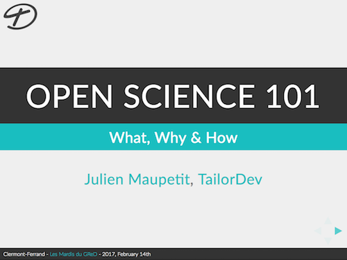

# Open Science 101

The What, Why & How of Open Science for modern scientists.

<!-- TODO -->
[](https://jmaupetit.github.io/open-science-101/)

## Presentation outline

1. What is Open Science?
2. Why opening my research matters?
3. How can I open my research?

## About the author

After studying biochemistry, Julien did his PhD in bio-informatics. He worked
has technical director of the Paris Diderot University structural
bio-informatics platform. After a short experience as the co-founder and CTO of
a small web agency, he decided to create [TailorDev](https://tailordev.fr).
Julien is an everyday enthusiast. He loves to promote knowledge sharing in
scientific and tech communities. Sometimes his beard is too long, but he's doing
his best to master his shaver.

## Hacking with this presentation

Install dependencies via:

```bash
$ npm install
```

Start playing:

```bash
$ make serve
```

Ship it!

```
$ make publish
```

## License

This presentation is licensed under a [Creative Commons Attribution-ShareAlike
4.0 International License](http://creativecommons.org/licenses/by-sa/4.0/) (see
LICENSE).
