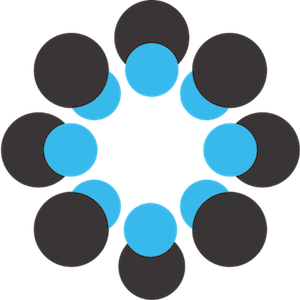

    <h2>Open Science 101</h2>
    <h4>What, Why & How</h4>

    <h6 class="author">
      <a href="https://twitter.com/julienmaupetit">Julien Maupetit</a>,
      <a href="https://tailordev.fr">TailorDev</a>
    </h6>
    

----

### Disclaimer

I am an Open Science advocate.

----

## Outline

1. What is Open Science?
2. Why opening my research matters?
3. How can I open my research?

----

## `$ whoami`
---

---

---

---

---

> Our mission is to develop modern tools to ease scientific work and promote Open
> Data, Open Science and Open Source in research entities.

---

### The Open Science Company Manifesto

[http://manifesto.tailordev.fr](http://manifesto.tailordev.fr)

----

## Open Science?

---

### A definition

> Open science is the movement to make scientific research, data and
dissemination accessible to all levels of an inquiring society, amateur or
professional.

<small>Source: [Wikipedia](https://en.wikipedia.org/wiki/Open_science)</small>

---

### Another definition

> Open Science describes the on-going transitions in the way research is
performed, researchers collaborate, knowledge is shared, and science is
organised. [...] facilitating more transparency, openness, networking,
collaboration, and refocuses science from a 'publish or perish' perspective to a
knowledge-sharing perspective.

<small>Source: [European Commission Blog](https://ec.europa.eu/commission/2014-2019/moedas/blog/opening-era-innovation_en)</small>

---

<small>Source: [Wikimedia commons](https://commons.wikimedia.org/wiki/File:Open_Science_-_Prinzipien.png)</small>

----

## Impacts

### Why does it matter?

---

### Ask yourself the good questions

* What is my data management plan?
* To whom belongs my research data?
* To whom will benefit my results?
* Who will make profit (`$`) of my research?

---

### Reproducibility

> Data not available. Study cannot be reproduced.

<small>Source: [Ingo Rohlfing's blog](https://ingorohlfing.wordpress.com/2015/06/18/two-proposals-for-incentivizing-data-archiving/)</small>

---

### Publishing is not enough

> On estime que les publications permettent d’accéder à environ 10 % de
celles-ci, le reste restant disponible mais non utilisé sur les disques durs
d’ordinateurs. Dans certaines disciplines, des résultats valables et importants
restent non publiés et beaucoup de données sont sous-utilisées ou perdues (c’est
en particulier le cas des données issues de résultats négatifs qui sont
oubliées).

<small>Source: Les enjeux éthiques du partage des données scientifiques • Avis
du COMETS (7 mai 2015)</small>

---

### Gateway to innovation

> Research data should go far beyond Academia.

---

### Citizen scientists

> If scientists want to monitor the effects of climate change on local
> ecosystems, for example, they can now use citizen reporting or data from
> smartphones.

<small>Source: [Open innovation, open science, open to the world, 2016](http://bookshop.europa.eu/en/open-innovation-open-science-open-to-the-world-pbKI0416263/;pgid=GSPefJMEtXBSR0dT6jbGakZD00007loyvfoz;sid=hswoNk2foSMochX7QvW2kS-6y682RAD8mL4=?CatalogCategoryID=Gj0KABst5F4AAAEjsZAY4e5L)</small>

----

## Toolbox

### How can I open my research?

---

### Create a blog

* Share your thoughts
* Ask feedback from your peers
* Increase your visibility
* Show your credibility in the field

➤ [medium.com](https://medium.com/)

---

### Use social media

* Increase your visibility
* Follow leaders from your field
* Interact with your peers

➤ [twitter.com](https://twitter.com/)

---

### Create an ORCID

> ORCID provides a persistent digital identifier that distinguishes you from
every other researcher and, through integration in key research workflows such
as manuscript and grant submission, supports automated linkages between you and
your professional activities ensuring that your work is recognized.

➤ [orcid.org](https://orcid.org)

---

### Share your protocols

> protocols.io is an open access platform used by thousands of researchers to
find and share life science protocols.

➤ [protocols.io](https://www.protocols.io)

---

### Use collaborative writing tools

> Authorea is used by over 65,000 researchers. It allows you to write, cite,
collaborate, host, and publish all in one place.

➤ [authorea.com](https://www.authorea.com)

---

### Get credit for your peer reviews

> Publons works with the world's top publishers so you can effortlessly track,
verify and showcase your peer review contributions across the world's journals.

➤ [publons.com](https://home.publons.com)

---

### Publish all the thing

> The Research Ideas and Outcomes (RIO) journal publishes all outputs of the
research cycle, including: project proposals, data, methods, workflows,
software, project reports and research articles together on a single
collaborative platform, with the most transparent, open and public peer-review
process.

➤ [riojournal.com](http://riojournal.com)

---

### Use preprint servers

> bioRxiv is a free online archive and distribution service for unpublished
preprints in the life sciences. [...] By posting preprints on bioRxiv, authors
are able to make their findings immediately available to the scientific
community and receive feedback on draft manuscripts before they are submitted to
journals.

➤ [biorxiv.org](http://biorxiv.org)

---

### Use data repositories

* Stored in the CERN infrastructure
* Get a DOI for your content
* Resource is discoverable
* Choose a license for your share

➤ [zenodo.org](https://zenodo.org)

---

### Use collaborative platform

➤ [osf.io](https://osf.io)

----

### Modern Science Weekly

> A free, once–weekly e-mail round-up of news and articles for everyone
interested in Open-(Data|Science|Source), Cutting-edge Science, Academia and
beyond!

[https://tinyletter.com/ModernScienceWeekly](https://tinyletter.com/ModernScienceWeekly)

----

### Thank you ♥️

[julien@tailordev.fr](mailto:julien@tailordev.fr)

[@julienmaupetit](https://twitter.com/julienmaupetit)

 [github.com/jmaupetit](https://github.com/jmaupetit/Scientific-Big-Data-challenges-sharing-and-ethics)

